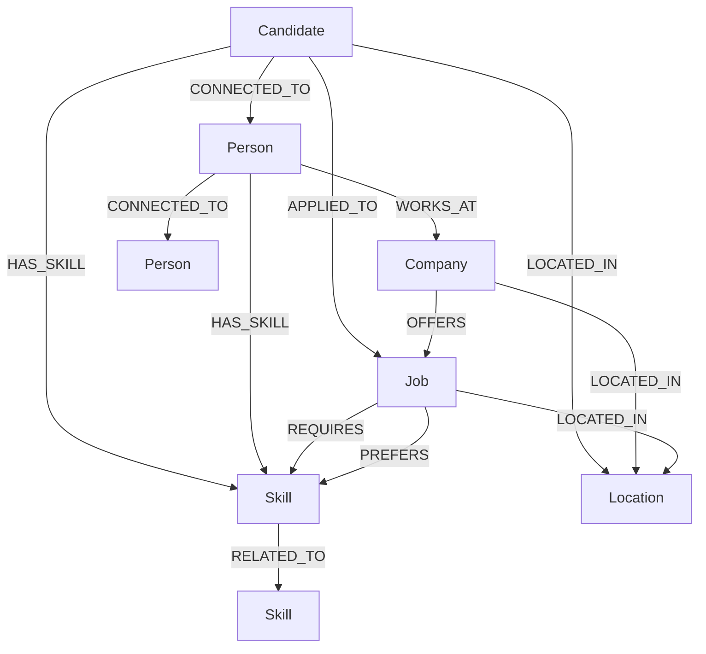
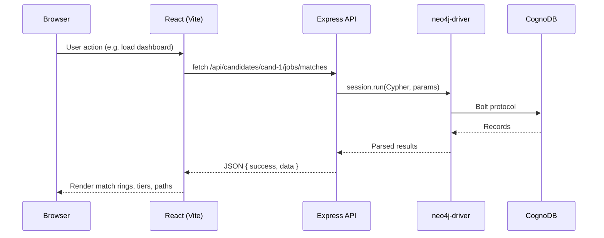

# HireGraph

**Graph-powered job discovery through skills and professional networks.**

**Live demo:** [Frontend](https://hire-smart-sigma.vercel.app) · [API](https://hiresmart-9x5i.onrender.com/api/health)

HireGraph is a full-stack demo that matches candidates to jobs by traversing a property graph in CognoDB (Neo4j-compatible). Instead of storing precomputed match scores, it derives fit at query time from `(Candidate)-[:HAS_SKILL]->(Skill)<-[:REQUIRES]-(Job)` overlap, then extends discovery through `(Candidate)-[:CONNECTED_TO]->(Person)-[:WORKS_AT]->(Company)-[:OFFERS]->(Job)` multi-hop paths. A React dashboard surfaces match tiers, skill gaps, network reach, and an interactive graph explorer — all backed by parameterized openCypher queries over Bolt.

---

## The Problem

Job boards list openings by keyword or recency. They do not answer harder questions a real candidate asks:

- Which roles actually fit my skill set, and which skills am I missing?
- Who in my network works at companies that are hiring?
- What is the shortest warm introduction path to a target company?

These questions mix **entity relationships** (skills, employers, connections) with **variable-depth traversal** (friend-of-friend, company reach). Modeling them in flat tables leads to many join tables, recursive queries, and duplicated denormalized data. HireGraph stores candidates, people, skills, jobs, companies, and locations as first-class nodes with typed edges, so one Cypher pattern can walk from a candidate through their network to an open role and compute skill overlap in the same query.

---

## Why a Graph Database?

### Entities and relationships in this project

HireGraph uses six node labels seeded in `backend/scripts/seed.js` and queried throughout `backend/src/cypher/`:

| Node label | Role |
|---|---|
| `Candidate` | Job seeker with skills and network links |
| `Person` | Professional contact (may work at a company, may hold skills) |
| `Skill` | Normalized technology skill |
| `Job` | Open role with required/preferred skills |
| `Company` | Employer that offers jobs |
| `Location` | Geographic location for candidates, companies, jobs |

Relationship types used in seed data and Cypher:

| Relationship | Pattern | Properties |
|---|---|---|
| `HAS_SKILL` | Candidate/Person → Skill | — |
| `REQUIRES` | Job → Skill | `importance: 'required'` |
| `PREFERS` | Job → Skill | `importance: 'preferred'` |
| `OFFERS` | Company → Job | — |
| `WORKS_AT` | Person → Company | `role` |
| `CONNECTED_TO` | Candidate/Person → Person | `since` |
| `LOCATED_IN` | Candidate/Company/Job → Location | — |
| `APPLIED_TO` | Candidate → Job | — |
| `RELATED_TO` | Skill → Skill | — (seeded; no API surface yet) |

### The centerpiece query: multi-hop opportunity discovery

This is the query that motivated the graph model — it finds active jobs at companies where a **direct** network contact works, then cross-references the candidate's skills against each job's requirements:

```cypher
MATCH (c:Candidate {id: $candidateId})-[:CONNECTED_TO]->(connector:Person)-[:WORKS_AT]->(comp:Company)-[:OFFERS]->(j:Job)
WHERE j.status = 'active'
MATCH (j)-[:REQUIRES]->(req:Skill)
WITH c, connector, comp, j, collect(DISTINCT req) AS requiredSkills
OPTIONAL MATCH (c)-[:HAS_SKILL]->(s:Skill)
WHERE s IN requiredSkills
WITH c, connector, comp, j, requiredSkills, collect(DISTINCT s) AS matchedSkills
OPTIONAL MATCH (j)-[:LOCATED_IN]->(loc:Location)
RETURN j.id AS jobId,
       j.title AS jobTitle,
       ...
       connector.name AS connectorName,
       size(requiredSkills) AS totalRequired,
       size(matchedSkills)  AS totalMatched
ORDER BY totalMatched DESC, j.title
```

**What it does:** Starting from one candidate, walk one `CONNECTED_TO` hop to a person, one `WORKS_AT` hop to their employer, one `OFFERS` hop to a job, collect required skills, intersect with the candidate's `HAS_SKILL` edges, and return match counts plus the connector who makes the path possible.

**Why this is awkward in SQL:** The same logic requires at minimum:

1. `candidates` → `candidate_connections` → `people` (1 hop)
2. `people` → `employment` → `companies` (employment hop)
3. `companies` → `jobs` (offers hop)
4. `jobs` → `job_requirements` → `skills` (skill collection)
5. `candidates` → `candidate_skills` → `skills` (overlap check)

That is **five separate join chains** in one query, with grouping to deduplicate skills. A second-degree variant adds a self-join on `people_connections`. In CognoDB, the path `(c)-[:CONNECTED_TO]->(p)-[:WORKS_AT]->(comp)-[:OFFERS]->(j)` is expressed as a single chained pattern — the hop count is explicit in the arrow syntax, not buried in join depth.

Match percentage is **not stored** in the graph. The service layer computes it after the query:

```javascript
Math.round(totalMatched / totalRequired * 100)
```

Tiers: `HIGH` ≥ 70%, `MEDIUM` ≥ 40%, else `LOW` (`backend/src/services/matching.service.js`).

### Candidate–skill matching (1-hop)

```cypher
MATCH (j:Job {id: $jobId})-[:REQUIRES]->(req:Skill)
...
OPTIONAL MATCH (c:Candidate {id: $candidateId})-[:HAS_SKILL]->(s:Skill)
WHERE s IN requiredSkills
```

In SQL this is a classic many-to-many overlap: `job_skills` joined to `candidate_skills` on `skill_id`, filtered by job and candidate primary keys. Graphs do not magically make that faster, but they keep skills as shared nodes — one `Skill` node participates in both `HAS_SKILL` and `REQUIRES` edges without a separate join table definition per relationship type.

### Network traversal (2nd-degree connections)

```cypher
MATCH (c:Candidate {id: $candidateId})-[:CONNECTED_TO]->(p1:Person)-[:CONNECTED_TO]->(p2:Person)
WHERE p2.id <> $candidateId
  AND NOT (c)-[:CONNECTED_TO]->(p2)
```

In SQL, this requires joining `connections` to itself (`c1.person_a = c2.person_b`) while excluding direct connections with a `NOT EXISTS` subquery. CognoDB expresses the two-hop walk directly; the exclusion filters are local `WHERE` clauses on the matched path.

### Shortest path to a company (bounded fallback, not `shortestPath()`)

CognoDB did not support native `shortestPath()` in this project. The implementation uses a **bounded variable-length match** and picks the shortest result:

```cypher
MATCH path = (c:Candidate {id: $candidateId})-[:CONNECTED_TO*1..4]->(p:Person)-[:WORKS_AT]->(comp:Company {id: $companyId})
RETURN [node IN nodes(path) | { label: ..., id: ..., name: ... }] AS pathNodes,
       length(path) AS hops
ORDER BY hops ASC
LIMIT 1
```

In SQL, shortest-path is typically a recursive CTE (`WITH RECURSIVE`) over an adjacency list, with depth limits and cycle detection added manually. Here, `*1..4` encodes the depth cap in the pattern itself.

### CognoDB compatibility workarounds

Several patterns were rewritten after CognoDB rejected them:

- **Inline `length()` on path patterns** → assign a named `path` variable first (`GET_REACHABLE_COMPANIES`)
- **`WHERE NOT (c)-[:HAS_SKILL]->(s)` pattern negation** → collect `ownedSkillIds` and filter with `WHERE NOT s.id IN ownedSkillIds` (`GET_NETWORK_SKILLS`)

---

## Data Model



### Node properties

| Node | Key properties |
|---|---|
| `Candidate` | `id`, `name`, `email`, `title`, `experienceYears`, `location`, `resumeText`, `createdAt` |
| `Person` | `id`, `name`, `title`, `email`, `location` |
| `Skill` | `id`, `name`, `normalizedName`, `category` |
| `Company` | `id`, `name`, `industry`, `size`, `location`, `logoUrl` |
| `Job` | `id`, `title`, `description`, `experienceMin`, `experienceMax`, `location`, `workMode`, `salaryMin`, `salaryMax`, `postedAt`, `status` |
| `Location` | `id`, `name`, `country` |

### Relationships

| Relationship | From | To | Properties |
|---|---|---|---|
| `HAS_SKILL` | Candidate, Person | Skill | — |
| `REQUIRES` | Job | Skill | `importance: 'required'` |
| `PREFERS` | Job | Skill | `importance: 'preferred'` |
| `OFFERS` | Company | Job | — |
| `WORKS_AT` | Person | Company | `role` |
| `CONNECTED_TO` | Candidate, Person | Person | `since` |
| `LOCATED_IN` | Candidate, Company, Job | Location | — |
| `APPLIED_TO` | Candidate | Job | — |
| `RELATED_TO` | Skill | Skill | — |

After seeding: **5** candidates, **15** people, **6** companies, **12** jobs, **18** skills, **5** locations, **165** relationships.

**Demo profile:** `cand-1` (Sushil Kumar) — 83% HIGH match on `job-1` (NovaTech Senior Full Stack Engineer); missing **Docker**; direct connection **Rahul Verma** (`person-1`) at NovaTech (`comp-1`), who holds Docker.

---

## Key Features

| Feature | How it works | API endpoint(s) |
|---|---|---|
| **Candidate dashboard with match tiers** | Loads candidate profile, all job matches sorted by tier, network opportunity count, reachable companies | `GET /api/candidates/:id`, `GET /api/candidates/:id/jobs/matches`, `GET /api/candidates/:id/opportunities`, `GET /api/candidates/:id/network` |
| **Job matching (computed, not stored)** | Cypher collects required vs matched skills; JS computes `Math.round(matched/total * 100)` and tier | `GET /api/candidates/:id/jobs/matches`, `GET /api/candidates/:id/jobs/:jobId/match` |
| **Skill gap detection** | Returns required skills where candidate has no `HAS_SKILL` edge (list-filter workaround) | Derived in match response as `missingSkills`; query: `GET_SKILL_GAP` in `matching.js` |
| **Network / 2nd-degree discovery** | Direct connections with employer info; 2-hop `CONNECTED_TO` excluding direct links | `GET /api/candidates/:id/network`, `GET /api/candidates/:id/network/second-degree` |
| **Multi-hop opportunity discovery** | `GET_NETWORK_OPPORTUNITIES` — jobs via network connectors with skill overlap | `GET /api/candidates/:id/opportunities` |
| **Shortest path to company** | Bounded `CONNECTED_TO*1..4` + `WORKS_AT`, `ORDER BY hops ASC LIMIT 1` — **not** `shortestPath()` | `GET /api/candidates/:id/path/company/:companyId` |
| **Graph Explorer** | Force-directed 2D graph via `react-force-graph-2d`; candidate- or job-centered subgraph | `GET /api/graph/candidate/:candidateId`, `GET /api/graph/job/:jobId` |
| **Resume parsing** | `pdf-parse` extracts text; `skills.dictionary.js` matches ~18 seeded skills and aliases — **no external LLM** (deterministic, offline-safe for demos) | `POST /api/resume/parse` |
| **JD parsing** | Regex + dictionary extraction of title, location, experience, work mode, skills | `POST /api/jobs/parse-jd` |
| **Graceful DB degradation** | Server boots even if CognoDB is unreachable; health returns 503 `degraded`; `dbGuard` middleware blocks data routes with `DATABASE_UNAVAILABLE`; frontend shows retry UI | `GET /api/health` + all guarded routes |

There is **no raw Cypher execution endpoint**. The browser never connects to CognoDB directly — all graph access goes through Express + `neo4j-driver`.

---

## Tech Stack

### Backend (`backend/package.json`)

| Package | Version | Role |
|---|---|---|
| **express** | ^4.21.2 | Thin HTTP layer — keeps Cypher in dedicated modules rather than buried in framework conventions |
| **neo4j-driver** | ^5.28.1 | Official Bolt driver for CognoDB connectivity |
| **cors** | ^2.8.5 | Restricts cross-origin access to `CLIENT_URL` |
| **dotenv** | ^16.4.7 | Loads root `.env` for CognoDB credentials |
| **multer** | ^1.4.5-lts.1 | In-memory PDF upload for resume parsing |
| **pdf-parse** | ^1.1.1 | Extracts text from uploaded PDF resumes |
| **vitest** | ^3.0.4 (dev) | Unit and integration test runner |

> `zod` is listed in dependencies but is **not imported anywhere** in `backend/src/` — unused.

### Frontend (`frontend/package.json`)

| Package | Version | Role |
|---|---|---|
| **react** / **react-dom** | ^18.3.1 | UI components and state |
| **react-router-dom** | ^6.29.0 | Client-side routing (Dashboard, Job Details, Network, Graph, Parser) |
| **react-force-graph-2d** | ^1.26.0 | Canvas-based graph visualization for Graph Explorer |
| **lucide-react** | ^0.475.0 | Icons |
| **vite** | ^6.1.0 | Dev server with `/api` proxy; production bundler |
| **tailwindcss** | ^3.4.17 | Utility-first styling |
| **@vitejs/plugin-react** | ^4.3.4 | JSX transform for Vite |

### Root (`package.json`)

| Package | Role |
|---|---|
| **concurrently** | Runs backend and frontend dev servers together via `npm run dev` |

---

## Architecture



**Security note:** CognoDB credentials (`COGNODB_URI`, `COGNODB_USERNAME`, `COGNODB_PASSWORD`) exist only on the backend. The frontend calls `/api/*` — in development Vite proxies to `localhost:4000`; in production you must proxy or point requests at the deployed API. Exposing Bolt credentials to the browser would allow arbitrary graph reads/writes.

---

## Project Structure

```
graphDb/
├── .env.example              # Environment variable template
├── package.json              # Root scripts: dev, install:all, seed, smoke, test
├── README.md
├── backend/
│   ├── package.json          # Backend dependencies and scripts
│   ├── vitest.config.js      # Test runner configuration
│   ├── scripts/
│   │   ├── seed.js           # CognoDB seed data (MERGE nodes + relationships)
│   │   └── smoke.js          # HTTP smoke test against running API
│   ├── src/
│   │   ├── server.js         # Bootstrap: connect CognoDB, start Express
│   │   ├── app.js            # Express app, CORS, route mounting
│   │   ├── config/
│   │   │   ├── env.js        # Environment variable loading
│   │   │   └── cognodb.js    # neo4j-driver init, connectivity, session factory
│   │   ├── cypher/           # Parameterized Cypher query strings
│   │   │   ├── candidate.js
│   │   │   ├── matching.js
│   │   │   ├── network.js
│   │   │   └── graph.js
│   │   ├── services/         # Business logic + result mapping
│   │   ├── controllers/      # HTTP handlers
│   │   ├── routes/           # Express routers
│   │   ├── middleware/       # dbGuard, error handler
│   │   └── utils/
│   │       └── skills.dictionary.js  # Skill normalization + text extraction
│   └── tests/
│       ├── matching.test.js           # Unit tests (match %, tiers, dictionary)
│       ├── network.integration.test.js # Live CognoDB multi-hop tests
│       └── fixtures/sample-resume.pdf
└── frontend/
    ├── package.json
    ├── vite.config.js        # Dev proxy: /api → localhost:4000
    ├── tailwind.config.cjs
    ├── postcss.config.cjs
    ├── index.html
    └── src/
        ├── main.jsx          # React entry
        ├── App.jsx           # Routes, health polling
        ├── api/client.js     # fetch wrapper (API_BASE = '/api')
        ├── pages/            # Dashboard, JobDetails, Network, GraphExplorer, Parser
        └── components/       # Navbar, States, MatchRing, StatMark
```

---

## Setup & Local Development

### Prerequisites

- **Node.js 18+** (no `engines` field or `.nvmrc` in repo; required by Vite 6 and neo4j-driver 5)
- A **CognoDB Cloud** free instance ([cognodb.cloud](https://cognodb.cloud))

### 1. Create a CognoDB instance

1. Sign up at CognoDB Cloud.
2. Create a **c0** (free tier) instance.
3. Copy the **Bolt URI** (`bolt+s://…databases.cognodb.cloud`), username (typically `cognodb`), and password.

### 2. Configure environment

```bash
cp .env.example .env
```

Edit `.env`:

```env
COGNODB_URI=bolt+s://<your-instance-id>.databases.cognodb.cloud
COGNODB_USERNAME=cognodb
COGNODB_PASSWORD=<your-password>
PORT=4000
CLIENT_URL=http://localhost:5173
NODE_ENV=development
SEED_RESET=false
```

| Variable | Purpose |
|---|---|
| `COGNODB_URI` | Bolt connection string |
| `COGNODB_USERNAME` / `COGNODB_PASSWORD` | CognoDB auth |
| `PORT` | Backend listen port (default 4000) |
| `CLIENT_URL` | Allowed CORS origin — must match frontend URL |
| `SEED_RESET` | When `true`, runs `MATCH (n) DETACH DELETE n` before seeding |

### 3. Install, seed, and run

```bash
# From project root
npm run install:all

# Load demo graph (requires valid CognoDB credentials)
npm run seed

# Start backend (:4000) + frontend (:5173) concurrently
npm run dev
```

Or run separately:

```bash
npm run dev --prefix backend    # node --watch src/server.js
npm run dev --prefix frontend   # vite on :5173
```

**Re-seeding:** Set `SEED_RESET=true` in `.env` to wipe all nodes before re-inserting. Default `false` uses `MERGE` — safe to run multiple times but won't remove stale data from prior schema experiments.

### 4. Verify

**Health check** (backend must be running):

```bash
curl http://localhost:4000/api/health
```

Connected:

```json
{
  "success": true,
  "data": {
    "status": "ok",
    "database": "connected",
    "timestamp": "2026-08-13T…",
    "version": "1.0.0",
    "service": "HireGraph API"
  }
}
```

Degraded (bad credentials or CognoDB down) — HTTP **503**:

```json
{
  "success": true,
  "data": {
    "status": "degraded",
    "database": "disconnected",
    ...
  }
}
```

**Smoke test** (backend must be running):

```bash
npm run smoke
```

Expect `Verified Endpoints: 15 / 15`.

**Frontend:** Open [http://localhost:5173](http://localhost:5173). Default candidate is `cand-1` (Sushil Kumar). You should see job matches with tier rings and network opportunities.

---

## Main Queries Explained

### 1. `GET_ALL_JOB_MATCHES` — dashboard job list

**File:** `backend/src/cypher/matching.js`  
**Endpoint:** `GET /api/candidates/:id/jobs/matches`

```cypher
MATCH (j:Job)
OPTIONAL MATCH (c:Candidate {id: $candidateId})
OPTIONAL MATCH (j)-[:REQUIRES]->(req:Skill)
WITH j, c, collect(DISTINCT req) AS requiredSkills
OPTIONAL MATCH (c)-[:HAS_SKILL]->(s:Skill)
WHERE s IN requiredSkills
WITH j, requiredSkills, collect(DISTINCT s) AS matchedSkills
...
RETURN ... size(requiredSkills) AS totalRequired, size(matchedSkills) AS totalMatched
```

Returns every job with required/matched skill lists and counts. Service layer adds `matchPercentage`, `tier`, and `missingSkills`.

### 2. `GET_NETWORK_OPPORTUNITIES` — network-sourced jobs

**File:** `backend/src/cypher/network.js`  
**Endpoint:** `GET /api/candidates/:id/opportunities`

Four-hop pattern: Candidate → Person → Company → Job, filtered to `j.status = 'active'`, with skill overlap. Returns `connectorName` — the person who links the candidate to the employer.

### 3. `GET_SECOND_DEGREE` — friend-of-friend

**File:** `backend/src/cypher/network.js`  
**Endpoint:** `GET /api/candidates/:id/network/second-degree`

Two `CONNECTED_TO` hops with exclusions for self and direct connections. Returns `viaNames` — which first-degree contacts bridge to each second-degree person.

### 4. `GET_NETWORK_SKILLS` — skills your network has that you don't

**File:** `backend/src/cypher/network.js`  
**Endpoint:** `GET /api/candidates/:id/network/skills`

Collects candidate's skill IDs, then finds `(c)-[:CONNECTED_TO]->(p)-[:HAS_SKILL]->(s)` where `s` is not owned. Returns holders per skill — e.g. Docker held by Rahul Verma.

### 5. `GET_OPPORTUNITY_PATH` — introduction path to a company

**File:** `backend/src/cypher/network.js`  
**Endpoint:** `GET /api/candidates/:id/path/company/:companyId`

Bounded `CONNECTED_TO*1..4` followed by `WORKS_AT` to target company. Returns ordered `pathNodes` array and `hops` count. Used on Job Details page when a match has a `companyId`.

---

## API Reference

All successful responses follow `{ "success": true, "data": … }`. Errors: `{ "success": false, "error": { "code": "…", "message": "…" } }`.

| Method | Path | Purpose | Example response shape |
|---|---|---|---|
| `GET` | `/api/health` | Service + DB status | `{ status, database, timestamp, version, service }` |
| `GET` | `/api/candidates` | List all candidates | `[{ id, name, email, title, experienceYears, location }]` |
| `GET` | `/api/candidates/:id` | Candidate profile | `{ id, name, email, title, experienceYears, location, resumeText, createdAt, locationName, locationCountry }` |
| `GET` | `/api/candidates/:id/skills` | Candidate skills | `[{ id, name, normalizedName, category }]` |
| `GET` | `/api/candidates/:id/jobs/matches` | All jobs with computed match | `[{ jobId, jobTitle, matchPercentage, tier, matchedSkills, missingSkills, requiredSkills, companyName, … }]` |
| `GET` | `/api/candidates/:id/jobs/:jobId/match` | Single job match detail | `{ jobId, jobTitle, matchPercentage, tier, matchedSkills, missingSkills, preferredSkills, companyId, salaryMin, salaryMax, … }` |
| `GET` | `/api/candidates/:id/network` | Direct connections + reachable companies | `{ direct: [{ id, name, title, companyName, connectedSince, … }], reachableCompanies: [{ companyId, companyName, minHops }] }` |
| `GET` | `/api/candidates/:id/network/second-degree` | 2nd-degree connections | `[{ id, name, title, viaNames, companyName, … }]` |
| `GET` | `/api/candidates/:id/network/skills` | Network skills candidate lacks | `[{ skillId, skillName, skillCategory, holders: [{ id, name, title }] }]` |
| `GET` | `/api/candidates/:id/opportunities` | Multi-hop network jobs | `[{ jobId, jobTitle, companyName, connectorName, matchPercentage, matchedSkills, … }]` |
| `GET` | `/api/candidates/:id/path/company/:companyId` | Shortest intro path | `{ pathNodes: [{ label, id, name, title }], hops }` or `null` |
| `GET` | `/api/jobs` | List all jobs | `[{ id, title, workMode, status, companyName, … }]` |
| `GET` | `/api/jobs/:id` | Single job | `{ id, title, description, experienceMin, experienceMax, … }` |
| `POST` | `/api/jobs/parse-jd` | Parse job description text | `{ title, skills: [{ name, category }], experienceMin, experienceMax, workMode, location }` |
| `GET` | `/api/graph/job/:jobId` | Job-centered graph | `{ nodes: [{ id, label, name, props }], edges: [{ source, target, type }] }` |
| `GET` | `/api/graph/candidate/:candidateId` | Candidate-centered graph | Same shape as job graph |
| `POST` | `/api/resume/parse` | Parse PDF resume (multipart `resume` field) | `{ rawText, detectedSkills: [{ name, normalized, category }] }` |

**Notes:**

- `POST /api/jobs/parse-jd` and `POST /api/resume/parse` do **not** require CognoDB — no `dbGuard`.
- All other data routes return **503** `{ code: "DATABASE_UNAVAILABLE" }` when CognoDB is disconnected.

---

## Deployment

### Backend — Render (Web Service)

| Setting | Value |
|---|---|
| **Root directory** | `backend` |
| **Build command** | `npm install` |
| **Start command** | `npm start` → `node src/server.js` |
| **Environment** | Node |

**Required environment variables:**

| Variable | Example |
|---|---|
| `COGNODB_URI` | `bolt+s://….databases.cognodb.cloud` |
| `COGNODB_USERNAME` | `cognodb` |
| `COGNODB_PASSWORD` | *(secret)* |
| `CLIENT_URL` | `https://hire-smart-sigma.vercel.app` (comma-separate for multiple: `https://hire-smart-sigma.vercel.app,http://localhost:5173`) |
| `PORT` | Render sets this automatically — do not hardcode |
| `NODE_ENV` | `production` |

After first deploy, run the seed script locally against the same CognoDB instance (`npm run seed` with production credentials in `.env`), or add a one-off Render shell job.

**Cold starts:** Render's free tier spins down after inactivity. First request after idle can take 30–60 seconds — the frontend health poll and initial dashboard load will feel slow until the service wakes.

### Frontend — Vercel

| Setting | Value |
|---|---|
| **Root directory** | `frontend` |
| **Build command** | `npm run build` |
| **Output directory** | `dist` |
| **Framework** | Vite |

**API routing:** Production builds read `VITE_API_URL` from `frontend/.env.production` (currently `https://hiresmart-9x5i.onrender.com/api`). Local dev falls back to `/api` via the Vite proxy. You can override in the Vercel dashboard by setting `VITE_API_URL` if the Render URL changes.

### CORS

`backend/src/app.js` configures:

```javascript
cors({ origin: env.CLIENT_URL, credentials: true })
```

`CLIENT_URL` on Render **must exactly match** your Vercel deployment URL (including `https://`, no trailing slash mismatch). If they differ, the browser blocks requests before they reach Express — a common deployment failure that looks like a network error in DevTools.

### Post-deploy verification

1. `curl https://hiresmart-9x5i.onrender.com/api/health` → `"database": "connected"`.
2. Open [https://hire-smart-sigma.vercel.app](https://hire-smart-sigma.vercel.app) → dashboard loads without the "Graph database unavailable" banner.
3. Confirm `cand-1` shows a **HIGH** match (~83%) on **Senior Full Stack Engineer** at NovaTech.
4. Click into the job → matched skills (React, TypeScript, Node.js, PostgreSQL, Neo4j) and missing **Docker**; introduction path shows **Rahul Verma**.
5. `/network` → direct connections and network skills include Docker via Rahul.
6. `/graph` → force graph renders candidate-centered subgraph.

---

## Testing

### Unit tests (no live DB required for logic)

```bash
npm run test
# equivalent: npm run test --prefix backend → vitest run
```

**File:** `backend/tests/matching.test.js` — 4 tests:

- Match percentage rounding (`5/6 → 83%`)
- Tier boundaries (`HIGH` ≥ 70, `MEDIUM` ≥ 40, `LOW` < 40)
- Skill normalization (`ReactJS` → `React`, `TS` → `TypeScript`)
- Skill extraction from free text

### Integration tests (requires live CognoDB)

**File:** `backend/tests/network.integration.test.js` — 2 tests (skipped automatically if `COGNODB_URI` or `COGNODB_PASSWORD` is missing):

- Multi-hop opportunities for `cand-1` include NovaTech Senior Full Stack via connector Rahul Verma with ≥ 70% match
- Parameterized Cypher returns reachable companies for `cand-1`

Run with valid `.env`:

```bash
npm run test --prefix backend
```

### Smoke test (requires running backend)

```bash
# Terminal 1
npm run dev --prefix backend

# Terminal 2
npm run smoke
```

Checks 13 GET endpoints + `POST /api/jobs/parse-jd` + `POST /api/resume/parse`. Accepts either 200 success or 503 graceful degradation on data routes; health accepts 200 or 503.

---

## Known Limitations / What I'd Do With More Time

| Gap | Detail |
|---|---|
| **Dictionary-based skill extraction** | Resume and JD parsing use `skills.dictionary.js` (~18 skills + aliases), not an LLM. Chosen for deterministic demo behavior without API keys; misses unlisted technologies. |
| **No native `shortestPath()`** | CognoDB required a bounded `*1..4` match + `ORDER BY hops LIMIT 1` instead of `shortestPath()`. Works for demo scale; would benchmark both on production CognoDB. |
| **`GET_SKILL_DEMAND` unused** | Query exists in `matching.js` / `matching.service.js` but no route exposes it. |
| **`RELATED_TO` skill edges seeded but unused** | No "skills to learn next" recommendation API yet. |
| **`zod` dependency unused** | Listed in `backend/package.json` but never imported — dead dependency. |
| **Render cold starts** | Free tier spins down; first request after idle can take 30–60s before API responds. |
| **Single demo write path** | No UI to add skills, connections, or jobs — read-only except parsers. |
| **No authentication** | All endpoints are open; suitable for a take-home demo only. |

**Next steps with more time:**

1. Expose `GET /api/skills/demand` using the existing `GET_SKILL_DEMAND` query and surface a "market demand" panel.
2. Replace dictionary parsing with an optional LLM fallback (keep dictionary as offline default) and expand skill coverage beyond the seeded 18.
3. Add authentication and write APIs for skills, connections, and jobs.

---

## Screenshots

<!-- Add these manually after deployment -->


---

## Demo Walkthrough Script

*Target duration: 60–90 seconds. Default profile: Sushil Kumar (`cand-1`).*

> **[0:00 — Dashboard]**  
> "This is HireGraph — a graph-native job discovery tool backed by CognoDB. I'm looking at Sushil Kumar, a full-stack engineer. The dashboard computes match tiers live from the graph — no stored scores. Sushil has several HIGH matches at 70% or above, and the stats show companies reachable through his network."
>
> **[0:15 — High-match job]**  
> "I'll open the Senior Full Stack Engineer role at NovaTech — an 83% HIGH match. The ring shows five of six required skills: React, TypeScript, Node.js, PostgreSQL, and Neo4j. The gap is Docker — one missing required skill."
>
> **[0:30 — Network path on Job Details]**  
> "Because this job is at NovaTech, HireGraph traced an introduction path through the graph: Sushil connects to Rahul Verma, who works at NovaTech. That's a bounded multi-hop Cypher query — not a precomputed lookup."
>
> **[0:40 — Network page]**  
> "On the Network page, I see Sushil's three direct connections and second-degree contacts. Under network skills, Docker appears — Rahul has it even though Sushil doesn't. That's the kind of insight a flat job board can't surface."
>
> **[0:55 — Graph Explorer]**  
> "Graph Explorer renders the candidate-centered subgraph — skills, connections, companies, and jobs as nodes with typed edges. I can switch to a job-centered view to see requirements and preferred skills."
>
> **[1:05 — Parser (optional)]**  
> "Resume and JD parsing use a local skill dictionary — no external AI — so demos stay reliable. Upload a PDF or paste a job description to extract skills instantly."
>
> **[1:15 — Close]**  
> "Everything runs through a thin Express API over neo4j-driver — the browser never touches CognoDB directly. Match percentages, network paths, and opportunity discovery are all computed from openCypher at request time."

---

## License

Private take-home project. Not licensed for redistribution.
